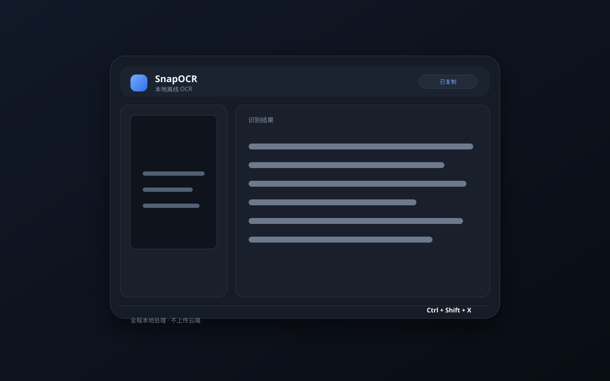

# SnapOCR

SnapOCR 是一个隐私优先的桌面端屏幕 OCR 工具。按下全局快捷键截取屏幕，SnapOCR 会在本机完成英文与简体中文识别，并自动把结果写入剪贴板。图片和识别文本不会上传到云端。



> 当前版本阶段：可运行的 Electron 基线，已包含全屏截取、托盘、全局快捷键、本地 OCR、自动复制和基础设置。区域选择、多显示器选择和历史记录仍待后续实现。

## 核心特性

- **全局快捷键截屏**：默认使用 `Ctrl+Shift+X`，在任意应用中唤起。
- **本地离线 OCR**：基于 Tesseract.js Web Worker 和支持离线打包的 `eng`、`chi_sim` 语言包。
- **托盘静默运行**：关闭面板后应用继续驻留系统托盘，可显隐窗口、立即截图或退出。
- **一键复制结果**：识别完成后通过 Electron 剪贴板 API 自动复制，也可以手动再次复制。
- **可中止 OCR**：初始化和识别过程中可以点击“停止”，立即终止 Tesseract Web Worker。
- **隐私安全边界**：渲染进程启用 `contextIsolation` 和 `sandbox`，关闭 `nodeIntegration`，仅暴露类型化 IPC API。
- **Spotlight 风格面板**：无边框悬浮窗口，失焦或按 `Esc` 自动隐藏。
- **可配置快捷键**：在设置面板中修改并立即验证快捷键是否可用。

## 技术栈

| 层 | 技术 | 用途 |
| --- | --- | --- |
| 桌面容器 | Electron | 主进程、托盘、全局快捷键、截屏、剪贴板 |
| 主进程构建 | electron-vite | 开发服务器与主进程/预加载/渲染层构建 |
| UI | React 19 + TypeScript | 交互界面与状态管理 |
| OCR | Tesseract.js | 在 Web Worker 中运行英文和简体中文 OCR |
| 图标 | lucide-react | 轻量界面图标 |
| 样式 | 原生 CSS | 无 UI 框架的桌面视觉与动画 |
| 打包 | electron-builder + NSIS | Windows 安装包 |

## 本地运行

环境要求：Node.js 20.19 或更高版本，以及 pnpm 或 npm。

```bash
# 使用 pnpm
pnpm install
pnpm dev

# 或使用 npm
npm install
npm run dev
```

`postinstall` 会下载以下文件到 `src/renderer/public`，使其在最终安装包中可用：

- `ocr/worker.min.js`
- `ocr/core/tesseract-core*.js|wasm`
- `tessdata/eng.traineddata`
- `tessdata/chi_sim.traineddata`

如果构建机无法访问默认语言包地址，可以提前准备 `tessdata` 目录并指定：

```powershell
$env:SNAPOCR_TESSDATA_PATH = "D:\tessdata"
pnpm install
```

也可以覆盖下载源：

```powershell
$env:SNAPOCR_TESSDATA_URL = "https://your-mirror.example.com/tessdata"
pnpm assets:ocr
```

## 构建与打包

```bash
# 类型检查
pnpm typecheck
npm run typecheck

# 构建主进程、预加载脚本和渲染页面
pnpm build
npm run build

# 仅生成未安装的应用目录
pnpm package
npm run package

# 生成当前平台安装包
pnpm dist
npm run dist

# 生成 Windows x64 NSIS 安装包
pnpm dist:win
npm run dist:win
```

输出目录为 `release/<version>/`。Windows NSIS 默认生成允许用户选择安装目录的安装包，并创建桌面和开始菜单快捷方式。

## 离线 OCR 打包说明

Tesseract.js 在浏览器环境中默认可能从 CDN 获取 worker、WASM core 和语言包。SnapOCR 不使用该默认行为：

1. `scripts/prepare-ocr-assets.mjs` 将 `tesseract.js` 的 worker 与 `tesseract.js-core` 的运行文件复制到 `src/renderer/public/ocr`。
2. 脚本将 `eng.traineddata` 和 `chi_sim.traineddata` 复制到 `src/renderer/public/tessdata`；缺失时从配置的镜像下载。
3. electron-vite 会把 `public` 目录原样发布到 `out/renderer`。
4. `electron-builder.yml` 使用 `asarUnpack` 解包 `out/renderer/ocr/**` 和 `out/renderer/tessdata/**`，确保 Web Worker 与 WASM 能从真实文件路径加载。
5. React 端通过当前页面 URL 构造 `workerPath`、`corePath` 和 `langPath`，开发和安装后都不依赖远程 CDN。

语言包会增加安装包体积；当前包含英文和简体中文。建议发布前执行一次 `pnpm assets:ocr` 并在完全断网的机器上验证安装包。

## 使用方式

1. 启动应用。主窗口默认不弹出，SnapOCR 驻留系统托盘。
2. 按 `Ctrl+Shift+X`，或点击托盘菜单中的“截取屏幕”。
3. SnapOCR 先隐藏自身，再截取主显示器全屏。
4. 面板打开后显示识别进度；如需中断，点击顶部的“停止”按钮。识别完成后，文本自动复制到剪贴板。
5. 按 `Esc`、点击面板外部或再次点击托盘图标，即可隐藏面板。
6. 点击右上角设置按钮，可修改全局快捷键。

## 目录结构

```text
SnapOCR/
├─ src/
│  ├─ main/                 # Electron 主进程：窗口、截屏、快捷键、托盘、IPC
│  ├─ preload/              # contextBridge 安全 API
│  ├─ renderer/             # React 页面与原生 CSS
│  │  ├─ public/ocr/        # 构建时生成/复制的 Tesseract worker 与 core
│  │  └─ public/tessdata/   # 构建时生成/复制的离线语言包
│  └─ shared/               # IPC 通道和跨进程类型
├─ scripts/prepare-ocr-assets.mjs
├─ docs/
├─ electron-builder.yml
├─ electron.vite.config.ts
├─ package.json
└─ tsconfig.json
```

## 安全设计

- `contextIsolation: true`
- `nodeIntegration: false`
- `sandbox: true`
- 仅通过 `contextBridge` 暴露白名单方法，不向前端提供原始 `ipcRenderer`
- IPC 处理器校验调用方必须是主窗口
- 生产环境使用受限的自定义 `snapocr://` 协议加载静态资源
- OCR 在 Chromium Web Worker 中运行，避免阻塞 React 主线程
- Tesseract 的 WASM core 需要 CSP 允许 `'wasm-unsafe-eval'`；不要将其替换为范围更大的 `'unsafe-eval'`。

## 已知限制

- 当前仅截取主显示器全屏；区域选择和指定显示器尚未实现。
- 全局快捷键是否可用取决于操作系统和其他应用的占用情况。
- macOS 首次截屏需要用户在“隐私与安全性”中授予屏幕录制权限。
- 极长文本、复杂排版、手写体和低分辨率图片的准确率由 Tesseract.js 决定。

## 贡献

欢迎提交 Issue 和 Pull Request。提交信息遵循 [Conventional Commits](https://www.conventionalcommits.org/)。建议的完整提交序列见 [docs/COMMITS.md](docs/COMMITS.md)。

## 开源协议

本项目基于 [MIT License](LICENSE) 开源。